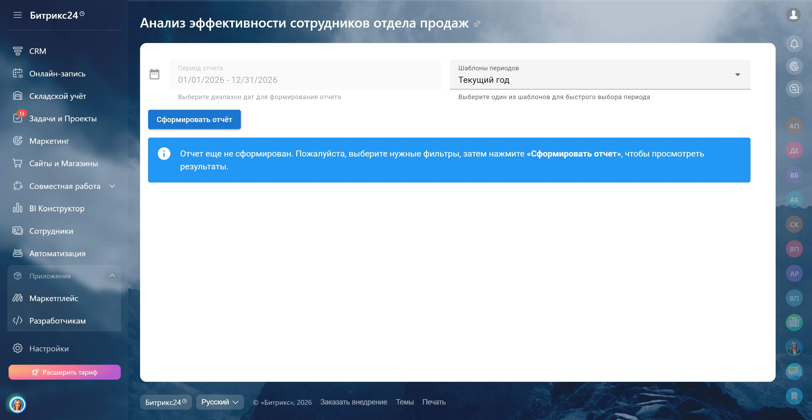
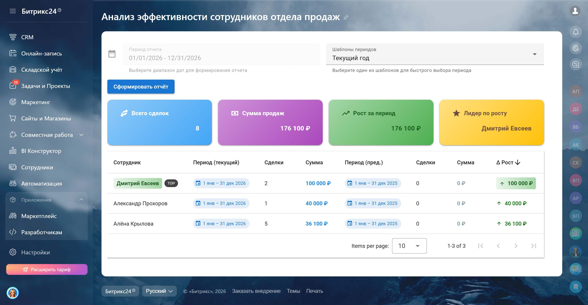
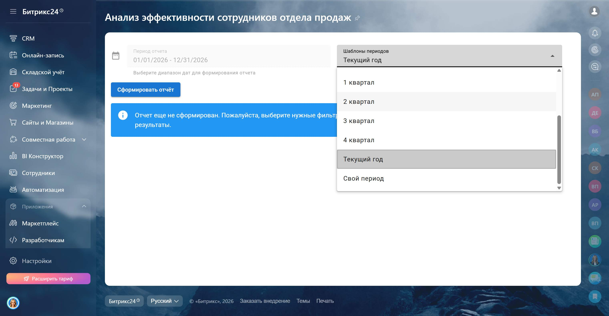
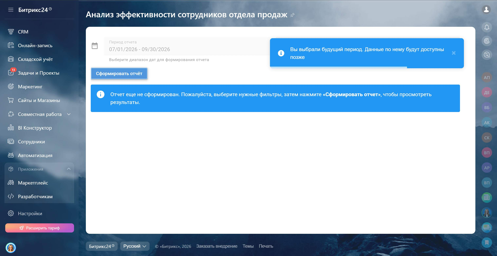
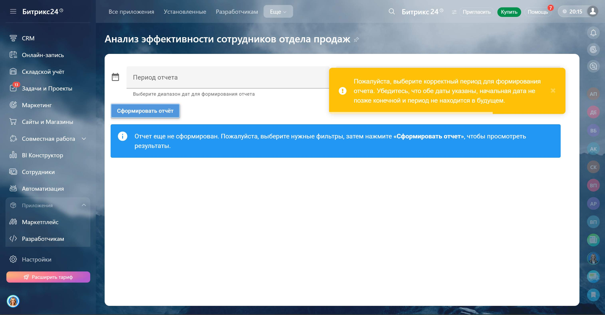

<h1 align="center">Рейтинг сотрудников по продажам 📈</h1>

Инструмент для анализа результатов отдела продаж и сравнения показателей по периодам

<b>📊 Контроль показателей • 📈 Анализ динамики • 🏅 Определение лидеров</b>

<h2>🎥 Демонстрация</h2>

 
<em>Работа приложения в реальном времени</em>

 

<table width="100%">
<tr>
<td align="center">
 
<em>Начальный экран</em>
</td>

<td align="center">
 
<em>Отчёт по данным</em>
</td>
</tr>

<tr>
<td align="center">
 
<em>Выбор периода</em>
</td>

<td align="center">
 
<em>Фильтрация по будущему периоду</em>
</td>
</tr>

<tr>
<td align="center">
 
<em>Фильтрация по некорректному периоду</em>
</td>

</tr>
</table>

<h2>🧩 Контекст задачи</h2>

Клиенту было важно видеть, как меняются результаты отдела продаж во времени:
сравнивать текущие показатели с предыдущими периодами и понимать динамику по каждому сотруднику.

Отчет должен был быть наглядным, с возможностью быстро выбрать период и сразу получить сравнение без дополнительных расчетов.

<h2>💡 Что было реализовано</h2>

<ul>
<li>Сравнение текущего периода с предыдущим в одном отчете</li>
<li>Автоматический расчет предыдущего периода</li>
<li>Отображение динамики по каждому сотруднику</li>
<li>Выделение лучших результатов</li>
<li>Гибкая настройка периода анализа</li>
</ul>

<h2>⚙️ Логика работы</h2>

<ul>
<li>Неделя сравнивается с предыдущей неделей</li>
<li>Произвольный диапазон — с аналогичным предыдущим периодом</li>
<li>Поддержка стандартных интервалов: неделя, месяц, квартал, год</li>
</ul>

<h2>📊 Метрики отчета</h2>

<table>
<tr>
<th>Показатель</th>
<th>Описание</th>
</tr>

<tr>
<td>Сотрудник</td>
<td>Менеджер по продажам</td>
</tr>

<tr>
<td>Текущий период</td>
<td>Количество и сумма сделок</td>
</tr>

<tr>
<td>Предыдущий период</td>
<td>Показатели за аналогичный период</td>
</tr>

<tr>
<td>Динамика</td>
<td>Изменение результатов между периодами</td>
</tr>
</table>

 

<ul>
<li>🟢 Рост — положительная динамика</li>
<li>🔴 Снижение — отрицательная динамика</li>
<li>🏆 Лучший сотрудник выделяется автоматически</li>
</ul>

<h2>🛠 Технологический стек</h2>

<table width="100%" cellpadding="10">
<tr>
<td align="center">
 
<b>Vue.js</b>
</td>

<td align="center">
 
<b>Vuetify</b>
</td>

<td align="center">
 
<b>TypeScript</b>
</td>

<td align="center">
 
<b>Vite</b>
</td>

<td align="center">
 
<b>CSS</b>
</td>

<td align="center">
 
<b>Bitrix24 REST API</b>
</td>
</tr>
</table>

<h2>📩 Контакты</h2>

Telegram: <a href="https://t.me/volodin7ergey">@volodin7ergey</a> 
VK: <a href="https://vk.com/volodin7ergey">vk.com/volodin7ergey</a>

<b>Готов разработать аналогичные решения под Ваши бизнес-процессы 💼</b>

