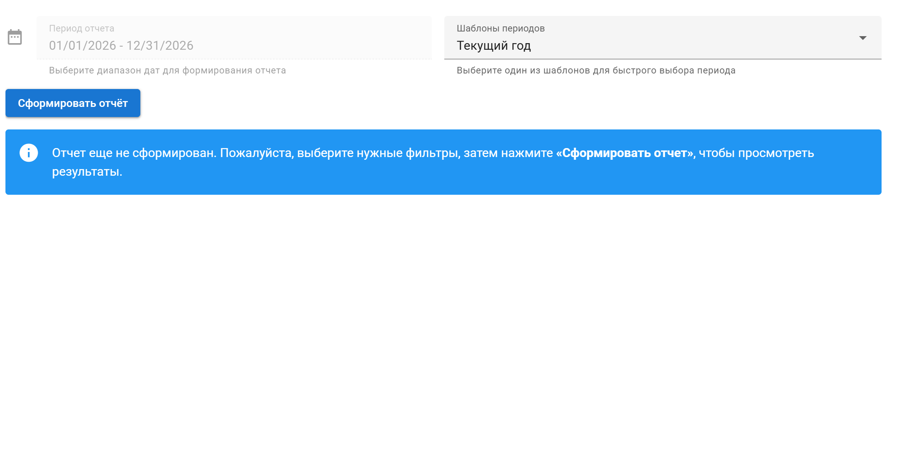
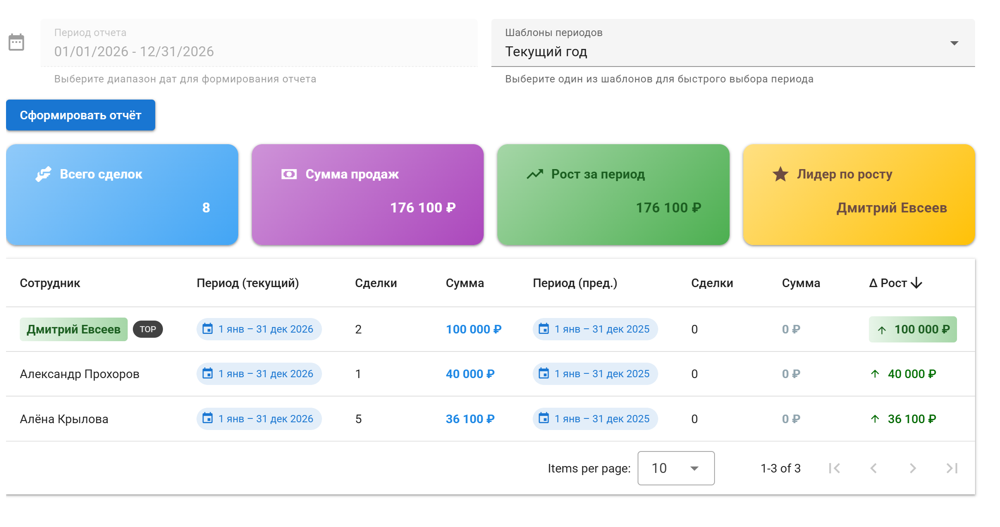
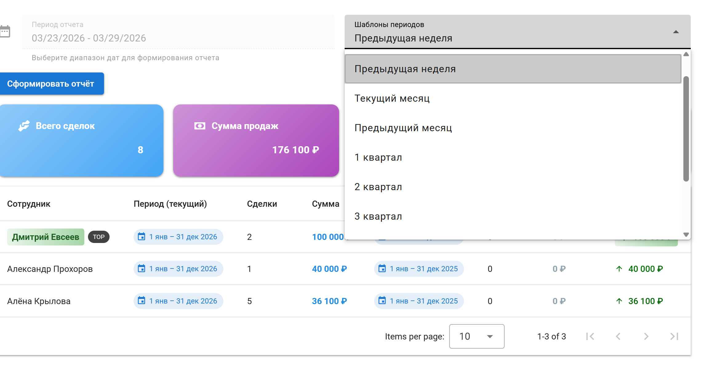
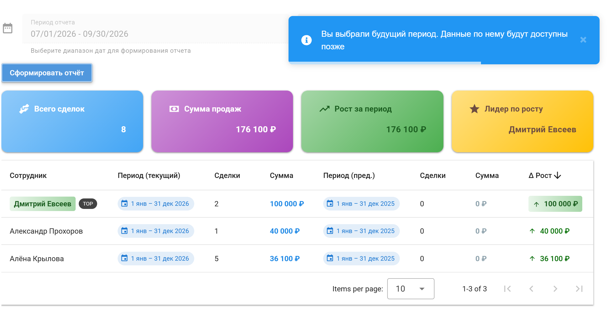

<h1>Рейтинг сотрудников по продажам 📈</h1>

Инструмент для анализа эффективности сотрудников отдела продаж в <b>Bitrix24</b>. 
Позволяет сравнивать текущие показатели с предыдущим периодом и отслеживать динамику роста.

<table width="600px" cellSpacing="1" cellpadding="1" border="1">
<tr><td></td></tr>
</table>

<h2>🔹 Проблема</h2>

Клиент столкнулся с необходимостью:

<ul>
<li>Оценивать эффективность сотрудников отдела продаж</li>
<li>Сравнивать текущие результаты с предыдущими периодами</li>
<li>Выявлять рост или падение показателей</li>
<li>Определять лучших сотрудников на основе данных</li>
</ul>

<h2>🔹 Решение</h2>

Разработал приложение, которое позволяет:

<ul>
<li>Сравнивать показатели сотрудников за текущий и прошлый период</li>
<li>Автоматически рассчитывать предыдущий период</li>
<li>Определять динамику роста продаж</li>
<li>Выделять лучших сотрудников по результатам</li>
<li>Гибко настраивать период анализа</li>
</ul>

<h2>🔹 Логика расчета периодов</h2>

<ul>
<li>Если выбран период "неделя" — сравнение идет с предыдущей неделей</li>
<li>Если выбран произвольный диапазон — берется аналогичный предыдущий период</li>
<li>Поддерживаются:
  <ul>
    <li>Текущая / предыдущая неделя</li>
    <li>Текущий / предыдущий месяц</li>
    <li>Кварталы (1–4)</li>
    <li>Текущий год</li>
    <li>Произвольные даты</li>
  </ul>
</li>
</ul>

<h2>🔹 Показатели отчета</h2>

<table>
<tr>
<th>Показатель</th>
<th>Описание</th>
</tr>
<tr>
<td>Сотрудник</td>
<td>Менеджер по продажам</td>
</tr>
<tr>
<td>Текущий период</td>
<td>Количество и сумма заключенных сделок</td>
</tr>
<tr>
<td>Предыдущий период</td>
<td>Количество и сумма сделок за прошлый период</td>
</tr>
<tr>
<td>Рост</td>
<td>Разница между текущим и предыдущим периодом</td>
</tr>
</table>

<b>Особенности отображения:</b>

<ul>
<li>Положительный рост — <b>зеленый цвет</b></li>
<li>Отрицательный рост — <b>красный цвет</b></li>
<li>Лучший сотрудник выделяется зеленым цветом</li>
</ul>

<b>Фильтры:</b>

<ul>
<li>Период (по дате завершения сделки)</li>
<li>Готовые пресеты (неделя, месяц, квартал, год)</li>
</ul>

<h2>🔹 Демонстрация работы приложения</h2>

<table>
<tr>
<td align="center">
 
<em>Загрузка приложения</em>
</td>

<td align="center">
 
<em>Начальный экран</em>
</td>
</tr>

<tr>
<td align="center">
 
<em>Вывод данных</em>
</td>

<td align="center">
 
<em>Фильтр по периоду</em>
</td>
</tr>

<tr>
<td align="center">
 
<em>Попытка фильтрации по ещё ненаступившему периоду</em>
</td>

<td align="center">
 
<em>Фильтрация по некорректно заданному периоду</em>
</td>
</tr>
</table>

<h2>🔹 Использованные технологии</h2>

<ul>
<li><b>Frontend:</b> Vue + Vuetify, JavaScript, Sass, Vite</li>
<li><b>Интеграция:</b> Bitrix24 API</li>
<li><b>Было выделено времени:</b> 7 дней</li>
<li><b>Время разработки:</b> 5 дней разработка + 2 дня тестирование</li>
</ul>

<h2>🔹 Контакты</h2>

Если заинтересовало или хотите аналогичное приложение:  

Telegram: <a href="https://t.me/volodin7ergey">@volodin7ergey</a> 
VK: <a href="https://vk.com/volodin7ergey">vk.com/volodin7ergey</a>

